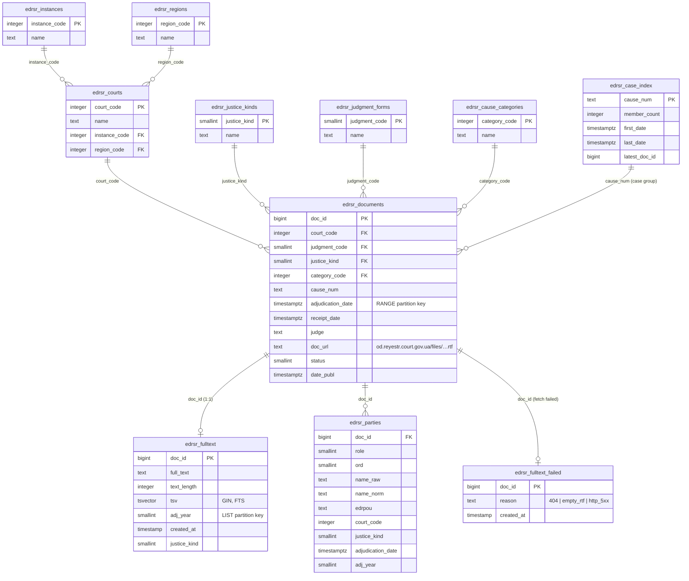
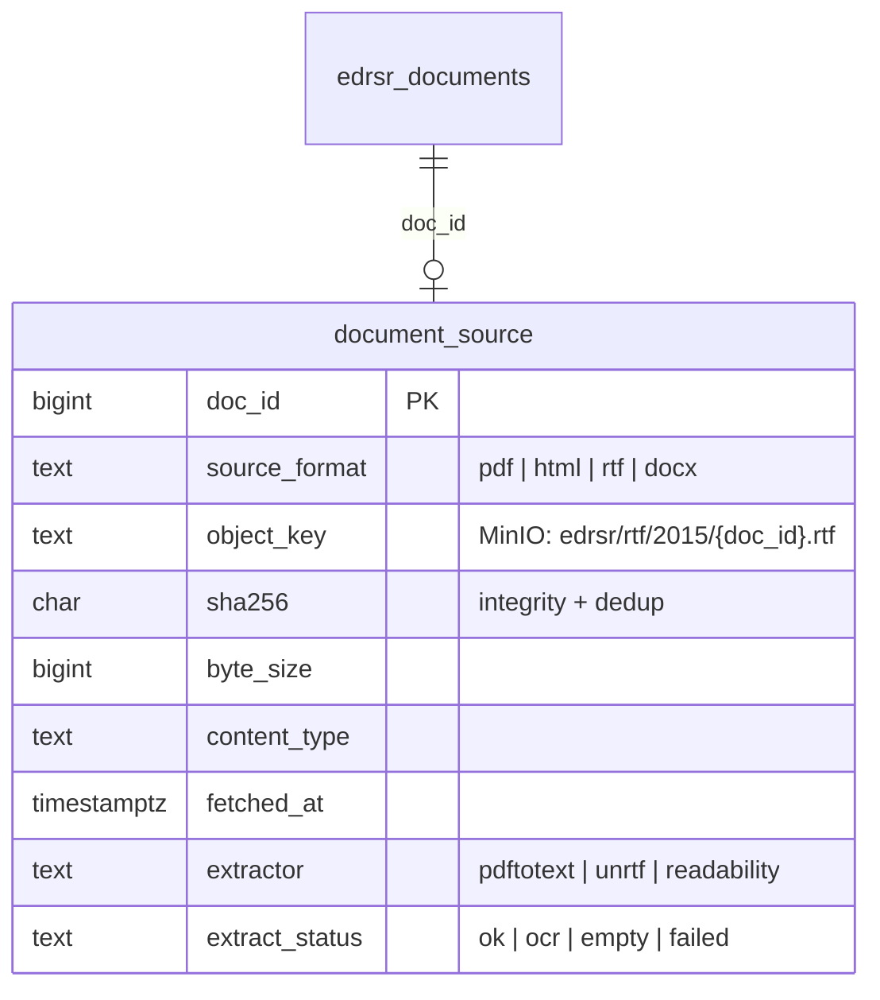

# ЄДРСР — Schema (Court Decisions Registry)

Data model for the Ukrainian State Register of Court Decisions (ЄДРСР) as stored in
`secondlayer_prod`. Source data comes from the open-data yearly dumps
(`data.gov.ua` → `edrsr_data_YYYY.zip`, TSV) plus per-document full texts fetched
from `od.reyestr.court.gov.ua`.

- **~100.9M** decisions (`edrsr_documents`), **~99.5M** with full text (`edrsr_fulltext`).
- Both fact tables are **partitioned by year**; the open-data dump is metadata-only
  (full text is fetched separately by `edrsr-fulltext-worker` via `doc_url`).

## Source vs. prod

| Open-data dump (TSV in `edrsr_data_YYYY.zip`) | Prod table |
|---|---|
| `instances.csv` (instance_code, name) | `edrsr_instances` |
| `regions.csv` (region_code, name) | `edrsr_regions` |
| `courts.csv` (court_code, name, instance_code, region_code) | `edrsr_courts` |
| `justice_kinds.csv` (justice_kind, name) | `edrsr_justice_kinds` |
| `judgment_forms.csv` (judgment_code, name) | `edrsr_judgment_forms` |
| `cause_categories.csv` (category_code, name) | `edrsr_cause_categories` |
| `documents.csv` (12 cols) | `edrsr_documents` (1:1) |
| — (no full text in dump) | `edrsr_fulltext` (fetched via `doc_url`) |

Everything beyond the dump — `edrsr_fulltext`, `tsv`, `edrsr_case_index`,
`edrsr_parties`, `edrsr_lexeme_df` — is derived/enriched in-house.

## Current schema (as-is on prod)

### Partitioning

| Table | Strategy | Key | Partitions |
|---|---|---|---|
| `edrsr_documents` | RANGE | `adjudication_date` (timestamptz) | `_p_YYYY`, `_p_pre2005`, `_p_default`, `_p_future` |
| `edrsr_fulltext` | LIST | `adj_year` (smallint) | `_p_YYYY`, `_p_pre2005`, `_p_default`, `_p_future` |
| `edrsr_parties` | LIST | `adj_year` | `_p_*` |

Per-partition indexes on `edrsr_fulltext_p_YYYY`: `GIN(tsv)` for FTS,
`UNIQUE(doc_id)`. Join `documents` ↔ `fulltext` by `doc_id`.

> Note: the two fact tables use different partition keys (RANGE-date vs LIST-year).
> They work (joined by `doc_id`), but a single year key would simplify maintenance.

## Proposed: original-document storage layer

The registry serves **RTF**; other corpora are **PDF / HTML**. Today only the
extracted plain text is kept. To preserve provenance and allow re-extraction,
store originals in **MinIO** (object storage) and keep a reference + provenance
row in Postgres. Do **not** store PDFs/HTML as `bytea` in Postgres.

- **Original** (PDF/HTML/RTF) → MinIO, keyed by `object_key`; gzip HTML before upload.
- **Searchable text** → stays in `edrsr_fulltext` (+ `tsv`); enable
  `toast.compression = lz4` on `full_text` (PG15).
- **Provenance** → `document_source` (`sha256` catches the "HTML page saved as .rtf"
  poisoning class of bug; `source_format` drives format-specific re-extraction).
- Optional big win: offload `full_text` bytes to MinIO too, keeping only
  `tsv` + `text_length` + a short preview in PG → shrinks the ~1.9 TB DB and speeds
  backups (trade-off: one MinIO fetch to render a decision).
